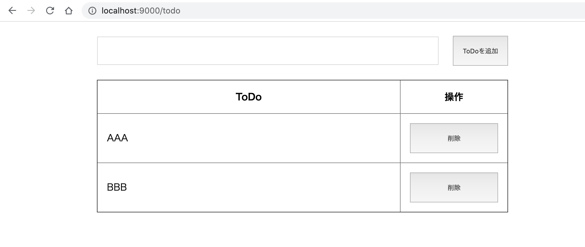
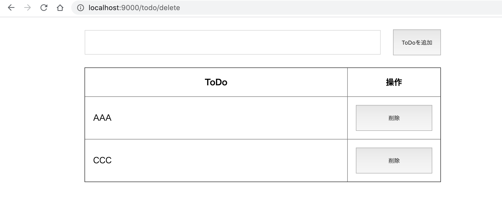

# Getting Started - Play Framework -

Javaの基本文法を学習したけど、具体的なWebアプリケーションの作り方が分からない。そんな方を対象にした書籍です。

本書では、JavaでWebアプリケーションを開発するためのWebフレームワーク『Play Framework』を用いて、簡単なToDoアプリケーションを開発する手順を学びます。

## 1. 対象読者
- Javaの基本文法を学習した方
- JavaでWebアプリケーションを開発してみたい方

## 2. Play Frameworkについて
Play Framworkは、JavaでWebアプリケーションを開発するためのWebフレームワークです。  

Java以外にも、Scalaと呼ばれるプログラミング言語にも対応しており、ScalaとPlay Frameworkを用いてWebアプリケーションを開発することもできます。

Webフレームワークについて分からない方は、[こちら(仮)](https://)を事前に読んでおくと良いでしょう。

Play Frameworkには以下の特徴があり、様々な企業で採用されています。
- 特徴1
- 特徴2

その他の詳細について知りたい方は、以下の公式サイトを見てみると良いでしょう。
https://www.playframework.com/

## 3. 開発環境の構築
早速Play Frameworkを使ってWebアプリケーションを開発していきましょう。

ただその前に、開発環境の構築から始めます。

本書では、執筆時点（2020年5月）での最新バージョンである、Play Framework 2.8.1を使用します。

本書で開発に使用する環境を以下に整理します。
|  環境  |  バージョン  |
| ---- | ---- |
|  Play Framework  |  2.8.1  |
|  JDK  |  AdoptOpenJDK build 1.8.0_252-b09  |
|  sbt  |  1.3.10  |

JDKはJavaファイルをコンパイル、実行するために使用します。  

sbtはPlay Frameworkでの開発で推奨されているビルドツールで、MavenやAntを使用したことがある方は、それらのツールに相当するものと思っていただければと思います。  

sbtを用いることで、Play Frameworkのプロジェクトの雛形を作成できたり、ソースコードの修正を即座に反映することができるなど、開発を効率化するための様々なメリットがあるので本書でも使用していきます。

以下、それぞれのインストール手順を示します。Play Framework自体はsbtでダウンロードできるので、事前の準備は不要です。

### 3.1 JDKのインストール
本書ではオープンソースのAdoptOpenJDKをインストールします。  
Macでbrewを使用されている場合は、以下のコマンドでインストールできます。
```
brew cask install adoptopenjdk/openjdk/adoptopenjdk8
```
その他の環境の方は、以下の公式サイトからダウンロードおよびインストールできます。
[AdoptOpenJDK](https://adoptopenjdk.net/index.html)


### 3.2 sbtのインストール
Macでbrewを使用されている場合は、以下のコマンドでインストールできます。
```
brew install sbt
```
その他の環境の方は、以下の公式サイトからダウンロードおよびインストールできます。
[sbt](https://www.scala-sbt.org/1.x/docs/Setup.html)

## 4. Play Frameworkを触ってみる
開発環境の準備ができたので、実際にPlay Frameworkを触っていきましょう。

### 4.1 雛形プロジェクトの作成
Play Frameworkでは、標準のディレクトリ構成があります。  

sbtのコマンドを用いることで、これらのディレクトリ構成およびサンプルファイルを格納した雛形プロジェクトを簡単に作成することができます。

以下の手順で実際に作成してみましょう。  

#### (1) 作業用ディレクトリへ移動
任意の作業用ディレクトリに移動します。
今回は、Desktop/workディレクトリで作業する例を示します。
```
mkdir ~/Desktop/work
cd ~/Desktop/work
```
#### (2) 雛形プロジェクトの作成
作業用ディレクトリに移動したら、以下のコマンドを実行します。
```
sbt new playframework/play-java-seed.g8
```
上記のコマンドを実行すると、途中で以下の2つの質問をされますので、それぞれ入力してEnterを押下します。
```
name [play-java-seed]: demo
organization [com.example]:
```
今回は、アプリケーション名はdemo、パッケージはデフォルトのまま（com.example）としました。

コマンド実行が正常に終了すると、作業用ディレクトリに、指定したアプリケーション名（今回はdemo）のディレクトリが作成されます。これが雛形プロジェクトになります。

他にもtargetというディレクトリが作成されることもありますが、こちらはsbtが内部で使用するものなので、今のところ意識する必要はありません。

### 4.2 雛形プロジェクトの起動
#### 4.2.1 雛形プロジェクトの起動
それでは、雛形のままで一度実行してみましょう。  
実行するには、demoディレクトリに移動し、`sbt run`を実行します。
```
$cd demo
$sbt run
```
初回実行時は、パッケージが諸々ダウンロードされますので時間が少しかかります。  
途中で停止せずに、しばらく待ちましょう。

しばらく待つと、以下が表示されます。
```
--- (Running the application, auto-reloading is enabled) ---

[info] p.c.s.AkkaHttpServer - Listening for HTTP on /0:0:0:0:0:0:0:0:9000

(Server started, use Enter to stop and go back to the console...)
```
Play Frameworkは初期設定だと9000番ポートで起動されます。  
この表示になったら、`http://localhost:9000/`にブラウザからアクセスしてみましょう。

以下の画面が表示されたら成功です。


#### 4.2.2 作成されたディレクトリ構成
作成されたディレクトリ構成について簡単に説明します。
開発者が主に修正していくのは、`app`ディレクトリ内のソースコードになります。
```
.
├── app
│   ├── controllers
│   │   └── HomeController.java
│   └── views
│       ├── index.scala.html
│       └── main.scala.html
├── build.sbt
├── conf
│   ├── application.conf
│   ├── logback.xml
│   └── routes
├── logs
├── project
│   ├── build.properties
│   ├── plugins.sbt
│   ├── project
│   └── target
├── public
│   ├── images
│   │   └── favicon.png
│   ├── javascripts
│   │   └── main.js
│   └── stylesheets
│       └── main.css
├── target
└── test
    └── controllers
        └── HomeControllerTest.java
```

|  主要ディレクトリ  |  格納物  |
| ---- | ---- |
|  app  |  Javaのソースコードや画面のテンプレートファイルを格納<br>主にこのディレクトリ内を修正していく  |
|  build.sbt  |  sbtのビルド定義ファイル<br>ライブラリを追加する場合はこのファイルに追記していく  |
|  conf  |  各種設定ファイルを格納<br>Webページのルーティングは、このディレクトリ内のroutesファイルに記載していく  |
|  logs  |  ログファイルを格納  |
|  project  |  ビルド関連のファイルを格納<br>使用するsbtのバージョンはbuild.propertiesで設定できる<br>プラグインを追加する場合はplugins.sbtに追記していく |
|  public  |  画像ファイルやjs/cssなどのリソースファイルを格納 |
|  target  |  ビルドで生成されたファイルを格納 |
|  test  |  テストファイルを格納 |

#### 4.2.3 各ファイルの役割
上記で`http://localhost:9000/`にアクセスすると、ブラウザ上に「Welcome to Play!」と表示されました。

このときに、各ファイルがどのように動いたのか確認していきます。

**(1) `routes`ファイル**  

最初に見るのは、`conf/routes`ファイルです。  

`routes`ファイルには、ルーティングを記載します。ここでのルーティングとは、「どのようなHTTPリクエストメソッド」で、「どのURL」にアクセスされたときに、「どのサーバサイド処理を呼び出す」かを定義したもののことです。  

具体的にファイルの中身を見ていきましょう。以下に今回の主要部分を抜粋します。
```
# An example controller showing a sample home page
GET     /                           controllers.HomeController.index
```
ルーティングの定義では、一番左にHTTPリクエストメソッド（GET/POSTなど）、中央にアクセスするURLパス、右に呼び出すJavaの処理を、パッケージ名、コントローラ名、メソッド名を繋げて記載します。

今回の場合だと、`ルートパス（/）`に`GETメソッド`でアクセスした際に、`controllers`パッケージの`HomeController`クラスにある`index`メソッドを呼び出す、といったルーティング定義になります。

それでは、`index`メソッドでどのような処理が行われているか見ていきましょう。

**(2) コントローラクラス**  

ルートパス（/）にGETメソッドでアクセスされた際の処理を見ていきます。
`controllers.HomeController.index`を開いてみましょう。以下抜粋し、コメントや空行を除外したものです。

```
public class HomeController extends Controller {
    public Result index() {
        return ok(views.html.index.render());
    }
}
```
コントローラクラスはPlay Frameworkの`Controller`クラスを継承して作成します。  
そしてクラスの中に、HTTPメソッドとURLパスに対応したメソッドを定義していきます。

`index`の処理では、Play Frameworkの`ok`メソッドを`return`しています。  
`ok`メソッドは、HTTPレスポンスのステータスコードを200（正常終了）で返却するメソッドです。  

また、`ok`の引数として、返却するテンプレートファイル（HTMLファイルのようなもの）を指定しています。  
`views.html.index.render()`のように記載すると、デフォルト設定では、`views`ディレクトリ内の`index.scala.html`をHTTPレスポンスとして返却するようになります。

それでは最後に、`index.scala.html`の中身を見ていきましょう。

**(3) テンプレートファイル**  

テンプレートファイルは、HTMLファイルのようなもので、Javaから任意の値を渡し、その値を埋め込んだ上で、HTMLファイルを生成することができます。

`index.scala.html`
```
@()

@main("Welcome to Play") {
  <h1>Welcome to Play!</h1>
}
```
`@main`で更に`main.scala.html`テンプレートを呼び出しています。`()`内の文字列は、`main.scala.html`に渡すパラメータになります（後述の`title`パラメータ）。  
`{}`内のHTMLも`main.scala.html`に渡すパラメータになっています（後述の`content`パラメータ）。  

それでは、`main.scala.html`も見てみましょう。`@*〜*@`の部分はコメントであり、下記では除外しています。
```
@(title: String)(content: Html)

<!DOCTYPE html>
<html lang="en">
    <head>
        <title>@title</title>
        <link rel="stylesheet" media="screen" href="@routes.Assets.versioned("stylesheets/main.css")">
        <link rel="shortcut icon" type="image/png" href="@routes.Assets.versioned("images/favicon.png")">
    </head>
    <body>
        @content

        <script src="@routes.Assets.versioned("javascripts/main.js")" type="text/javascript"></script>
    </body>
</html>
```
1行目では、`main.scala.html`は2つのパラメータを受け取ることを示しています。  
それぞれ`index.scala.html`から渡された以下の値が格納されます。
```
title="Welcome to Play"
content=<h1>Welcome to Play!</h1>
```
`<title>`タグ内と`<body>`タグ内で、これらの変数を参照しています。  
したがって、最終的には以下のようなHTMLとなり、Webブラウザには"Welcome to Play!"と表示されます。
```
<!DOCTYPE html>
<html lang="en">
    <head>
        <title>Welcome to Play</title>
        <link rel="stylesheet" media="screen" href="/assets/stylesheets/main.css">
        <link rel="shortcut icon" type="image/png" href="/assets/images/favicon.png">
    </head>
    <body>
        <h1>Welcome to Play!</h1>

        <script src="/assets/javascripts/main.js" type="text/javascript"></script>
    </body>
</html>
```

以上で、簡単に`routes`ファイル、コントローラクラス、テンプレートファイルを見てきました。  

基本的にはこれらのファイルを追加、編集し、画面を作成していきます。  

以降の章では、今回作成した雛形を少しずつ改良し、最終的には簡単なToDoアプリを開発していきます。

## 5. ToDoアプリケーションの開発
### 5.1 ToDoアプリケーション概要
今回開発するToDoアプリケーションは、以下のような画面です。


ページはindexページのみで、indexページにToDoを追加するテキストボックスおよび追加ボタンを表示し、
その下に、登録されたToDoの一覧を表示する構成にします。  
登録されたToDoは、削除ボタンを押下することで削除できます。完了したToDoはどんどん削除していきましょう。

本書読了後に、読者の力のみで機能追加をしてみると、更なる理解の向上が期待できます。  
（ヒント：ToDoの詳細入力機能の追加、未着手/着手中/完了などのステータスの追加、etc...）

### 5.2 ルーティングの定義
実装を始める前に、必要になるルーティングを設計します。  
このように予め設計をしておくことで、実装が楽になります。

今回必要になるルーティングを以下に整理します。
|  HTTPリクエストメソッド  |  URLパス  |  機能  |  コントローラ.メソッド  |
| ---- | ---- | ---- | ---- |
|  GET  |  /todo  |  登録されたToDoの一覧を取得  |  controllers.TodoController.list  |
|  POST  |  /todo  |  ToDoの追加  |  controllers.TodoController.post  |
|  POST  |  /todo/delete  |  リクエストパラメータとしてidをPOST。idに指定したToDoを削除  |  controllers.TodoController.delete  |

### 5.3 画面の作成
それではアプリケーションの概要と、必要になるメソッドの整理が終わったので、実際に実装していきましょう。  

まずは画面から作成します。  
雛形プロジェクトでは`index.scala.html`と`main.scala.html`の2つがありますが、今回は`index.scala.html`のみ使用するので、`main.scala.html`の方はファイルごと削除します。  

次に、`index.scala.html`を以下のように書き換えます。
```
@()

<!DOCTYPE html>
<html lang="ja">
<head>
    <title>ToDoアプリ</title>
    <link rel="stylesheet" media="screen" href="@routes.Assets.versioned("stylesheets/main.css")">
    <link rel="shortcut icon" type="image/png" href="@routes.Assets.versioned("images/favicon.png")">
</head>
<body>
<div id="container">
    <div id="inputTodoArea">
        <input type="text" id="todoName" name="todoName">
        <button type="submit">ToDoを追加</button>
    </div>
    <table border="1" id="todoTable">
        <thead>
        <tr>
            <th>
                ToDo
            </th>
            <th>
                操作
            </th>
        </tr>
        </thead>
        <tbody>
        <tr>
            <td>
                AAA
            </td>
            <td>
                <button type="submit">削除</button>
            </td>
        </tr>
        </tbody>
    </table>
</div>
</body>
</html>
```
まだJava側から何もパラメータを渡していないため、1行目の`@()`内は空にしています。  

その他は簡単なHTMLとなっており、追加するToDoの入力欄（`inputTodoArea`）と、ToDoの一覧を表示する`table`で構成されています。今はテストデータ`AAA`を表示しているだけです。

簡単にレイアウトを整えるため、CSSも少しだけ記載します。  
`public/stylesheets/main.css`を開いて、以下を記載してください。
```
input {
    padding: 16px;
}

button {
    padding: 16px;
}

#container {
    width: 700px;
    display: flex;
    flex-direction: column;
    margin: 24px auto;
}

#inputTodoArea {
    display: flex;
    flex-direction: row;
    justify-content: space-between;
    align-items: center;
    margin-bottom: 24px;
}

#todoName {
    flex-grow: 1;
    margin-right: 24px;
}

#todoTable {
    border-collapse: collapse;
}

#todoTable th,td {
    padding: 16px;
    width: 100%;
}

#todoTable button {
    width: 150px;
}
```
`index.scala.html`と`main.css`の修正が完了したら、再度`sbt run`を実行し、`http://localhost:9000`にアクセスしてみます。  


上記のように表示されれば成功です。  
これで画面の準備ができました。

### 5.4 ルーティング定義の作成
`5.2 ルーティングの定義`で定義したルーティングを、`routes`ファイルに実装していきます。
実装といっても、ルーティングを記載するだけなので簡単ですね。
```
# Routes
# This file defines all application routes (Higher priority routes first)
# ~~~~

# An example controller showing a sample home page
GET     /                           controllers.Default.redirect(to = "/todo")
GET     /todo                       controllers.TodoController.list
+ nocsrf
POST    /todo                       controllers.TodoController.post(request: Request)
+ nocsrf
POST    /todo/delete                controllers.TodoController.delete(request: Request)

# Map static resources from the /public folder to the /assets URL path
GET     /assets/*file               controllers.Assets.versioned(path="/public", file: Asset)
```
ルートパス（/）にアクセスした際もtodoの一覧を取得したいので、`/todo`にリダイレクトするようにしていいます。その他は`5.2 ルーティングの定義`で定義した通りですね。  
`post`と`delete`メソッドは、HTTPリクエストパラメータを受け取る必要があるので、引数として`request: Request)`を指定しています。  
また、今回はCSRF（Cross Site Request Forgeries）については取り扱わないため、POSTメソッドの前に`+ nocsrf`を付与してCSRFチェックを無効化しています。

次にコントローラクラスを実装していきます。

### 5.5 コントローラクラスの作成
TodoControllerクラスを作成する前に、雛形で用意されているHomeController.javaはもう不要なので削除します。

次に、`TodoController.java`を`controllers`パッケージ直下に作成します。
```
package controllers;

import play.mvc.*;

public Result list() {
    return ok(views.html.index.render());
}

public Result post(Http.Request request) {
    return ok(views.html.index.render());
}

public Result delete(Http.Request request) {
    return ok(views.html.index.render());
}
```
`routes`に定義したメソッドの枠だけ作成しました。  
まだどのメソッドも`index.scala.html`を返却しているだけのシンプルな構成です。  
`post`メソッドと`delete`メソッドはリクエストパラメータを取得する必要があるため、`Http.Request`を引数にしています。  
各メソッドの中身について、以降で作成していきます。

#### 5.4.1 postメソッドの作成
まずはToDoを実際に登録できるようにしたいので、`TodoController.post`メソッドから実装していきます。  
コントローラを修正する前に、まずはPOSTされた値を格納するFormクラスを作成しましょう。  
`controllers.TodoForm.java`を作成し、以下を記述します。
```
package controllers;

public class TodoForm {

    private Long id;
    private String todoName;

    public Long getId() {
        return id;
    }

    public void setId(Long id) {
        this.id = id;
    }

    public String getTodoName() {
        return todoName;
    }

    public void setTodoName(String todoName) {
        this.todoName = todoName;
    }
}
```
Todoを識別する`id`と、ToDoの名前を格納する`todoName`を定義し、それぞれのsetter/getterを定義しています。  
コントローラクラスでは、このTodoFormクラスにPOSTされた値をバインドして使用します。  

次に、コントローラクラスを修正していきます。
```
package controllers;

import com.google.inject.Inject;
import play.mvc.*;
import play.data.Form;
import play.data.FormFactory;
import play.data.DynamicForm;

public class TodoController extends Controller {

    private Form<TodoForm> form;

    @Inject
    public TodoController(FormFactory formFactory) {
        this.form = formFactory.form(TodoForm.class);
    }

    public Result list() {
        return ok(views.html.index.render());
    }

    public Result post(Http.Request request) {
        Form<TodoForm> todoForm = form.bindFromRequest(request);
        TodoForm todo = todoForm.get();
        String todoName = todo.getTodoName();
        System.out.println("todoName " + todoName);
        return ok(views.html.index.render());
    }

    public Result delete(Http.Request request) {
        return ok(views.html.index.render());
    }
}
```
変更点は、コンストラクタ（`public TodoController(FormFactory formFactory)`）が追加された点と、`post`メソッドの中身です。  

コンストラクタでは、POSTされた値をFormクラスにバインドするための準備をしています。  
ここで作成された`form`を用いることで、`post`メソッドの1行目のように記載すると、POSTされた値を`TodoForm`クラスにバインドすることができます。

後は`post`メソッドの中で、`todo.getXXX()`と記載することで、POSTされた値（`id`や`todoName`）を取得することができるようになります。

今回の例では、POSTされた`todoName`の値を取得し、コンソールに出力するようにしています。

次に、画面に入力された`todoName`をPOSTできるように、`index.scala.html`を修正していきます。  
`inputTodoArea`の箇所を以下のように修正してください。
```
<form action="/todo" method="post">
    <div id="inputTodoArea">
        <input type="text" id="todoName" name="todoName">
        <button type="submit">ToDoを追加</button>
    </div>
</form>
```
`form`タグを追加し、ToDoを追加ボタンが押下されたら、画面に入力された`todoName`の値を`/todo`にPOSTするようにしています。

ここまで準備ができたら、実際に画面に入力した値がコントローラで取得できるか試してみましょう。

再度`sbt run`を実行し、以下のようにToDo名を入力後、ToDoを追加ボタンを押下してみます。


`sbt run`していたコンソールに、以下のように入力した`todoName`が出力されていれば成功です。
```
2020-05-17 22:46:40 INFO  play.api.Play  Application started (Dev) (no global state)
todoName サンプルToDo
```
無事、POSTされた値をコントローラで取得できていることが確認できました。

現状では、POSTされた値をコンソールに出力しているだけなので、この値を保持するようにしてみましょう。
今回はデータベースは使用せず、単純にクラス内にリストを用意し、用意したリストに追加していきます。

以下のように修正してみましょう。

まずは`controllers.TodoModel.java`を作成します。中身はほとんど`TodoForm.java`と同じですが、Formクラスはリクエストの取得にのみ使用したいため、あえて別のクラスとして作成します。
```
package controllers;

public class TodoModel {

    private Long id;
    private String todoName;

    public Long getId() {
        return id;
    }

    public void setId(Long id) {
        this.id = id;
    }

    public String getTodoName() {
        return todoName;
    }

    public void setTodoName(String todoName) {
        this.todoName = todoName;
    }
}
```
次に、コントローラクラスを以下のように修正します。
```
package controllers;

import com.google.inject.Inject;
import play.data.Form;
import play.data.FormFactory;
import play.mvc.*;

import java.util.ArrayList;
import java.util.List;

public class TodoController extends Controller {

    private Form<TodoForm> form;
    private List<TodoModel> todos = new ArrayList<TodoModel>();

    @Inject
    public TodoController(FormFactory formFactory) {
        this.form = formFactory.form(TodoForm.class);
    }

    public Result list() {
        return ok(views.html.index.render());
    }

    public Result post(Http.Request request) {
        Form<TodoForm> todoForm = form.bindFromRequest(request);
        TodoForm todo = todoForm.get();
        String todoName = todo.getTodoName();
        Long todoId = todos.stream().max((t1, t2) -> (int) (t1.getId() - t2.getId())).map(t -> t.getId()+1).orElse(1L);

        TodoModel model = new TodoModel();
        model.setId(todoId);
        model.setTodoName(todoName);
        todos.add(model);

        return ok(views.html.index.render());
    }

    public Result delete(Http.Request request) {
        return ok(views.html.index.render());
    }
}
```
変更したのは、クラスに`todos`というリストを追加したのと、`post`メソッド内の処理です。  
追加した`todos`のリストに、入力されたToDoの一覧を格納するようにします。  

`post`メソッドでは、`todos`の中からidの最大値を取得し、最大値+1の値を新しいToDoのidとして`TodoModel`を作成し、それを`todos`に`add`しています。  

これで、画面に入力したToDoが随時、変数`todos`に追加されるようになりました。

次は、登録したToDoを一覧で表示できるように、`list`メソッドを実装していきます。

#### 5.4.2 listメソッドの作成
コントローラクラスから、`index.scala.html`に値を渡すには、`return`の箇所の`render()`の引数に、渡したい値を設定します。  

今回はToDoの一覧が格納された変数`todos`を画面に渡したいので、`render(todos)`のように修正します。  
また、`list`メソッド以外でも`index.scala.html`を`render`しているので、同じように`render`の引数に`todos`を設定します。
```
package controllers;

import com.google.inject.Inject;
import play.data.Form;
import play.data.FormFactory;
import play.mvc.*;

import java.util.ArrayList;
import java.util.List;

public class TodoController extends Controller {

    private Form<TodoForm> form;
    private List<TodoModel> todos = new ArrayList<TodoModel>();

    @Inject
    public TodoController(FormFactory formFactory) {
        this.form = formFactory.form(TodoForm.class);
    }

    public Result list() {
        return ok(views.html.index.render(todos));
    }

    public Result post(Http.Request request) {
        Form<TodoForm> todoForm = form.bindFromRequest(request);
        TodoForm todo = todoForm.get();
        String todoName = todo.getTodoName();
        Long todoId = todos.stream().max((t1, t2) -> (int) (t1.getId() - t2.getId())).map(t -> t.getId()+1).orElse(1L);

        TodoModel model = new TodoModel();
        model.setId(todoId);
        model.setTodoName(todoName);
        todos.add(model);

        return ok(views.html.index.render(todos));
    }

    public Result delete(Http.Request request) {
        return ok(views.html.index.render(todos));
    }
}
```
これでコントローラクラスから`index.scala.html`に変数`todos`の値を渡すことができたので、次に`index.scala.html`の方で`todos`の値を出力できるように修正していきます。
```
@(todos: List[TodoModel])

<!DOCTYPE html>
<html lang="ja">
<head>
    <title>ToDoアプリ</title>
    <link rel="stylesheet" media="screen" href="@routes.Assets.versioned("stylesheets/main.css")">
    <link rel="shortcut icon" type="image/png" href="@routes.Assets.versioned("images/favicon.png")">
</head>
<body>
<div id="container">
    <form action="/todo" method="post">
        <div id="inputTodoArea">
            <input type="text" id="todoName" name="todoName">
            <button type="submit">ToDoを追加</button>
        </div>
    </form>
    <table border="1" id="todoTable">
        <thead>
        <tr>
            <th>
                ToDo
            </th>
            <th>
                操作
            </th>
        </tr>
        </thead>
        <tbody>
        @for(todo <- todos) {
            <tr>
                <td>
                    @todo.getTodoName()
                </td>
                <td>
                    <button type="submit">削除</button>
                </td>
            </tr>
        }
        </tbody>
    </table>
</div>
</body>
</html>
```
変更箇所として、まず1行目に受け取るパラメータを追記しています。注意点として、テンプレートファイルにList型を記載する場合は、Javaの場合の`List<>`とは異なり、`List[]`で記載します。  

次の変更箇所として、`<tbody>`の中身で`@for`を使用するように変更しています。  
`@for`はテンプレートファイル内で使用できる構文で、Javaのfor文のようなものです。  
ここでは、`todos`からひとつずつ要素を取得し、変数`todo`に格納しています。  
後は変数`todo`から`getTodoName()`で`todoName`を取得し、表示しています。  

ここまでできたら、実際に実行してみましょう。  

最初は何もToDoを登録していないので、以下のように表示されます。


この状態でToDoを入力し、ToDoを追加ボタンを押下してみます。例えばAAAとBBBの2つを追加すると、以下のように表示されます。


無事、ToDoを登録して、一覧で表示するとこまでできました。  
（この時点では、複数の問題が残っています。それらの問題については、今後の課題として以下の教材を参考に各自で解消してみてください。）

[二重送信(仮)]()

最後に、削除機能を実装してみましょう。

#### 5.4.3 deleteメソッドの作成
コントローラクラスの修正の前に、まずは`index.scala.html`を修正していきます。  
削除ボタンの方にも`<form>`タグを追加し、削除対象のToDoのidをPOSTするように修正します。
```
@(todos: List[TodoModel])

<!DOCTYPE html>
<html lang="ja">
<head>
    <title>ToDoアプリ</title>
    <link rel="stylesheet" media="screen" href="@routes.Assets.versioned("stylesheets/main.css")">
    <link rel="shortcut icon" type="image/png" href="@routes.Assets.versioned("images/favicon.png")">
</head>
<body>
<div id="container">
    <form action="/todo" method="post">
        <div id="inputTodoArea">
            <input type="text" id="todoName" name="todoName">
            <button type="submit">ToDoを追加</button>
        </div>
    </form>
    <form action="/todo/delete" method="post">
        <table border="1" id="todoTable">
            <thead>
            <tr>
                <th>
                    ToDo
                </th>
                <th>
                    操作
                </th>
            </tr>
            </thead>
            <tbody>
            @for(todo <- todos) {
                <tr>
                    <td>
                        @todo.getTodoName()
                    </td>
                    <td>
                        <button type="submit" name="id" value="@todo.getId()">削除</button>
                    </td>
                </tr>
            }
            </tbody>
        </table>
    </form>
</div>
</body>
</html>
```
変更箇所として、まず`<table>`の前に`<form>`を追加し、削除ボタンが押下された際に`/todo/delete`にPOSTされるようにしました。  

次に、削除対象のToDoのidをPOSTするために、削除ボタンのvalue値としてtodoのidを設定しています。これで、削除ボタンが押下されたToDoのidがPOSTされるようになります。  

idがPOSTされるようになったので、コントローラクラスを修正していきます。
```
public Result delete(Http.Request request) {
    Form<TodoForm> todoForm = form.bindFromRequest(request);
    TodoForm todo = todoForm.get();
    Long id = todo.getId();

    todos = todos.stream().filter(t -> !t.getId().equals(id)).collect(Collectors.toList());

    return ok(views.html.index.render(todos));
}
```
`delete`メソッドのみの修正のため、`delete`メソッドのみ抜粋しています。  
まずは`post`メソッドと同じように、リクエストパラメータをFormクラスにバインドし、POSTされたidを取得しています。  

次に、`todos`の中からPOSTされたidに該当するtodoをフィルタして、`todos`から除外しています。  
これでPOSTされたidのToDoを削除することができました。  

実際に動かしてみましょう。  

まずは適当にToDoを追加します。


次に、BBBの削除ボタンを押下してみましょう。  
BBBが削除されて、以下のように表示されれば成功です。


これで、今回作成予定だったToDoアプリの一通りの機能が完成しました。

## 6. さいごに
ここまで実装された方はお疲れ様でした。  

Getting Startedということで、ルーティングやコントローラ、テンプレートについて、Play Frameworkの基本的な部分は理解できたのではないでしょうか？  

ただし本書中に記載したとおり、今回作成したToDoアプリは、様々な箇所で問題点が残っています。  

例として挙げると、
- サーバを再起動すると登録していたToDoのリストはどうなるか
- 同時に複数ユーザでToDoを追加/削除した場合はどうなるか
- 画面を介さず直接POSTされた場合はどうなるか
- ToDo登録後に画面をリロードするとどうなるか

上記に挙げた以外にも、様々なセキュリティ上の問題、アプリケーションアーキテクチャ上の問題が残っています。  

本書ではPlay Frameworkの基礎について触れましたが、実際のアプリケーション開発では、これらの観点についても意識して開発する必要があります。  

実際に手を動かしながらこれらの観点を身につけるために、セキュリティやアーキテクチャについて学習した後、再度本書のToDoアプリケーションを改良および機能追加してみることをお勧めします。
